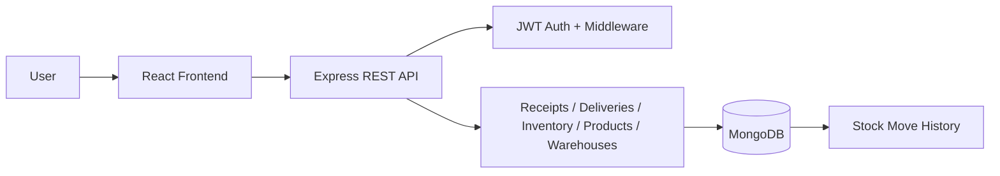

# StockSense

StockSense is a full-stack warehouse operations system for managing receipts, deliveries, inventory adjustments, product catalog data, warehouse locations, and stock-move traceability.

The project has a React frontend and an Express + MongoDB backend, with JWT authentication and a workflow driven by inventory and stock availability rules.

## Features

- User registration and login
- JWT-based session protection
- Product catalog management
- Warehouse and location management
- Receipt workflow: draft → ready → done
- Delivery workflow: draft → waiting / ready → done
- Inventory adjustment support
- Stock availability checks for shortage scenarios
- Stock movement history and traceability
- Responsive dashboard and operational pages
- Print-ready receipt and delivery views

## Tech Stack

Frontend
- React 19
- Vite
- React Router
- Vanilla CSS design system

Backend
- Node.js
- Express.js
- MongoDB + Mongoose
- JWT authentication
- bcryptjs
- express-validator

## Repository Structure

```text
stocksense_odoo_project/
├── backend/
│   ├── src/
│   ├── .env
│   ├── .env.example
│   ├── package.json
│   ├── README.md
│   ├── start-local.ps1
│   └── ...
├── frontend/
│   ├── src/
│   ├── package.json
│   ├── vite.config.js
│   └── ...
├── StockSense-SVG.svg
├── README.md
└── .gitignore
```

## Architecture Overview



## Requirements

Before running the project locally, make sure you have:

- Node.js 18+ or later
- npm
- MongoDB installed on the machine
- A local MongoDB replica set for transaction-ready workflows

## Local Setup

### 1. Install dependencies

Backend:

```bash
cd backend
npm install
```

Frontend:

```bash
cd frontend
npm install
```

### 2. Configure environment variables

The backend uses a local `.env` file. An example file is included in the backend folder.

Key settings include:

```env
PORT=5000
MONGO_URI=mongodb://127.0.0.1:27018/stocksense?replicaSet=rs0
JWT_SECRET=your_long_random_secret
JWT_EXPIRES_IN=1d
CORS_ORIGIN=http://127.0.0.1:5173
```

### 3. Start MongoDB replica set

A Windows helper script is available in the backend folder:

```powershell
cd backend
.\start-local.ps1
```

This script:
- starts a user-owned MongoDB instance on port 27018
- initializes a single-node replica set named `rs0`
- keeps the default MongoDB service on port 27017 untouched
- launches the backend with the persisted `.env` settings

### 4. Run the backend

```bash
cd backend
npm run dev
```

The backend will run at:

- http://localhost:5000
- API health: http://localhost:5000/api/health

### 5. Run the frontend

```bash
cd frontend
npm run dev
```

The frontend runs at:

- http://127.0.0.1:5173

## Demo Account

A seeded demo user is available for quick testing:

- Login ID: `stockdemo`
- Password: `StockSense!Demo2026`

This account is useful for exploring:
- dashboard metrics
- waiting backlog state
- receipt and delivery operations
- inventory adjustments
- stock move history

## Main Business Flow

### Receipt flow

```text
DRAFT -> READY -> DONE
```

When a receipt is marked done:
- stock is added to inventory
- a stock move of type `IN` is created
- related totals and dashboard metrics update

### Delivery flow

```text
DRAFT -> WAITING / READY -> DONE
```

When a delivery is processed:
- stock availability is checked
- if stock is insufficient, it is marked as `WAITING` with a shortage warning
- when ready it can complete and stock is deducted
- a stock move of type `OUT` is created

### Inventory adjustments

Inventory can be adjusted manually with a reason and quantity change. These changes are recorded as `ADJUSTMENT` entries in the stock history.

## API Overview

### Auth
- POST /api/auth/register
- POST /api/auth/login
- GET /api/auth/me
- POST /api/auth/logout

### Dashboard
- GET /api/dashboard

### Products
- GET /api/products
- POST /api/products
- PUT /api/products/:id
- DELETE /api/products/:id

### Warehouses and locations
- GET /api/warehouses
- POST /api/warehouses
- GET /api/locations
- POST /api/locations

### Receipts
- GET /api/receipts
- POST /api/receipts
- PATCH /api/receipts/:id/status
- POST /api/receipts/:id/cancel
- GET /api/receipts/:id/print

### Deliveries
- GET /api/deliveries
- POST /api/deliveries
- PATCH /api/deliveries/:id/status
- POST /api/deliveries/:id/cancel
- GET /api/deliveries/:id/print

### Inventory and traceability
- GET /api/inventory
- POST /api/inventory/adjustments
- GET /api/moves

## Project Status

The project is configured and verified for the local development workflow:
- frontend lint passes
- frontend production build passes
- backend JavaScript syntax checks pass
- backend health endpoint returns healthy status
- live API and frontend are connected and respond correctly

## Notes

- The app is designed for a local development environment and uses a user-owned replica-set MongoDB instance to support transaction-aware inventory workflows.
- The backend `.env` file is intentionally ignored by git so local secrets and tokens remain private.
- The project is optimized for warehouse operations and is suitable as a demo, prototyping, or internal inventory management tool.

## License

This project is for local development and internal demonstration use unless otherwise specified by the repository owner.

